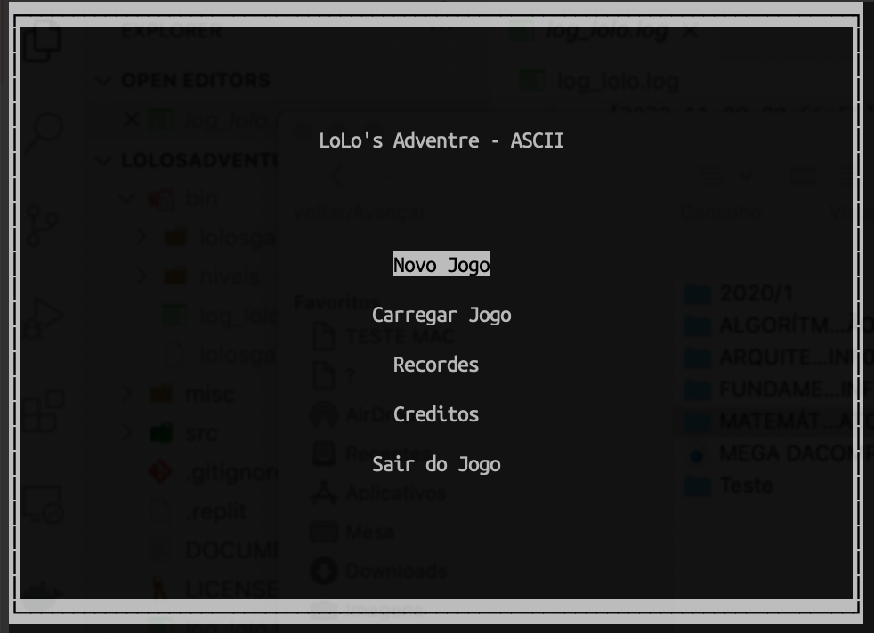
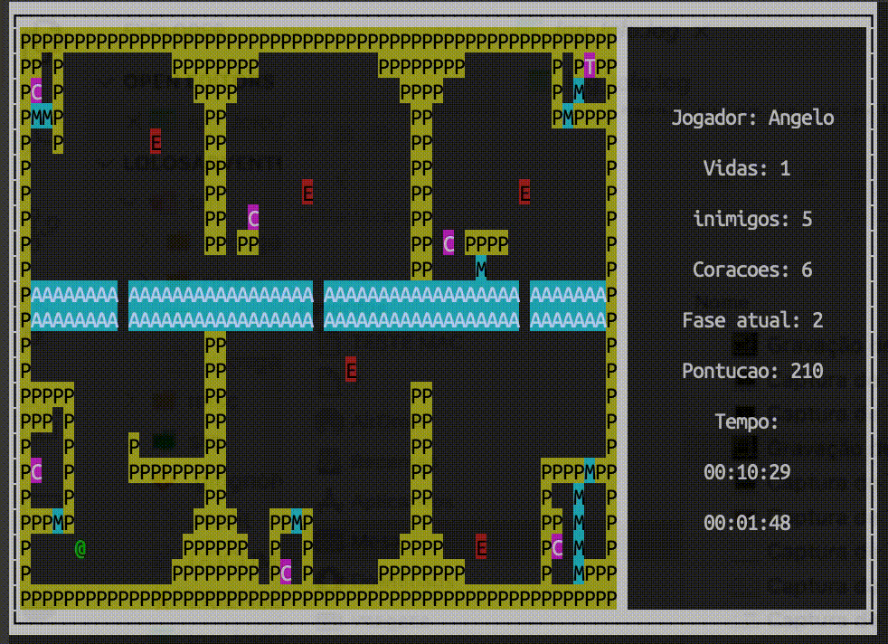
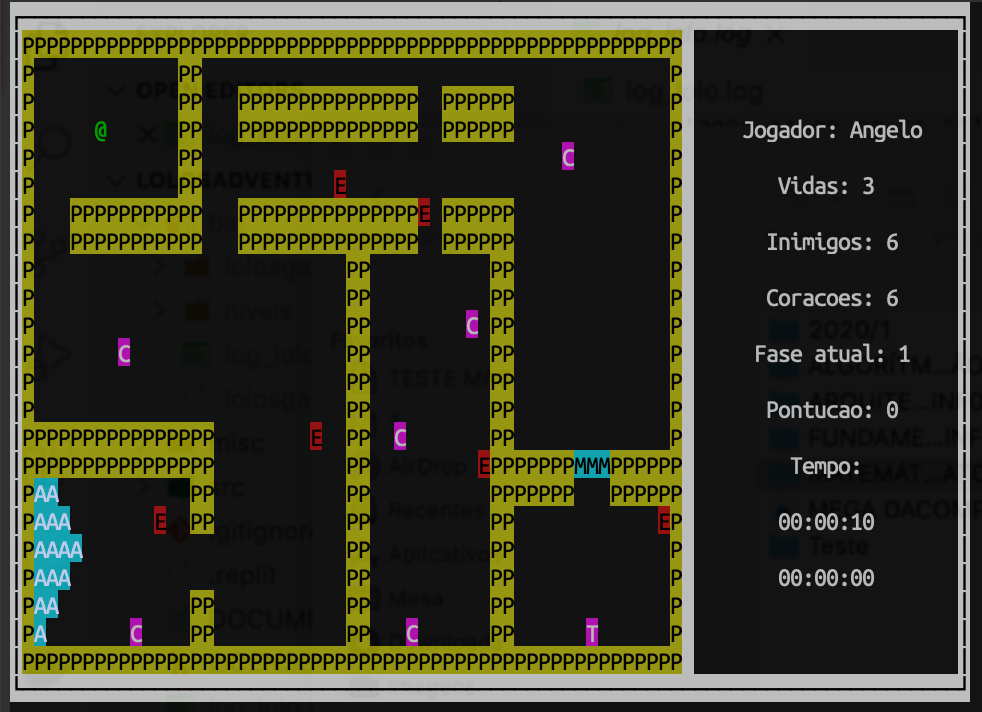

[](https://repl.it/github/angww/LolosAdventureASCII)

# LolosAdventureASCII

> Versão simplificada em terminal do jogo Lolo's Adventure, lançado em 1989 para a plataforma NES.

:memo:  Este jogo é um trabalho de graduação para a cadeira de INF01202 - Algoritmos e Programação, curso de Ciência da Computação da UFRGS.

<p align="center">
    </img><br /><br />
    </img><br /><br />
    </img><br />
</p>

## Como compilar e rodar

1. Clone o repositório

```bash
$ git clone https://github.com/angww/LolosAdventureASCII
```

2. Abra o diretório criado

```bash
$ cd LolosAdventureASCII
```

3. Utilize o make com o argumento run para compilar e já rodar o jogo

```bash
$ make run
```

Pronto! Este comando irá compilar todas as dependências, criar o executável em `bin/lolosgame.out` e rodar o game.

Caso seja compilado com a opção `DEBUG` habilitada, será criado o arquivo `bin/log_lolo.log` que terá informações básicas sobre o que está ocorrendo no jogo. Recomenda-se rodar o jogo com uma janela lado a lado escutando o log. Pode-se usar `tail -F bin/log_lolo.log`.


## Modificações

* Menu principal

Adicionado menu de recordes que armazenam as cinco maiores pontuções, com a seguinte estrutura:

```C
typedef struct {
    char nome_jogador[9];
    int totalpts;
    time_t tempo_total;
} recorde_st;
```

* Funcionamento do jogo

Adicionado registro de tempo para fases.

* Vidas

Ao invés do Lolo necessitar pegar um coração antes de eliminar um inimigo, ele pode eliminar o inimigo a qualquer momento.
A fase recomeça apenas após Lolo se afogar.
Lolo não ganha uma vida ao eliminar o 10º inimigo consecutivo.

* Pontuação

Cada inimigo eliminado soma 30 ao invés de 1.

* Implementação

Na estrutura de gravação foi adicionado registro de início e final do tempo de jogo.

``` C
typedef struct {
    int identificador;
    int totalpts;
    int ultimafase;
    int vidas;
    char nome_jogador[9];
    time_t inicio;
    time_t final;
} gravacao_st;
```

A estrutura da fase foi alterada para armazenar informações sobre o início e o estado atual da fase, `elementos` armazena o grid estático, `lolo` e `bau` armazenam a posição inicial de Lolo e do baú, respectivamente, `inimigo` armazena o ponteiro para cada inimigo, `inimigos_num` e `coracoes_num` armazenam a quantidade de inimigos e corações, respectivamente.
```C
typedef struct {
    char elementos[JOGO_JANELA_Y][JOGO_JANELA_X];
    ponto_st lolo;
    ponto_st bau;
    int coracoes_num;
    int inimigos_num;
    inimigo_st **inimigos;
} mapa_st;
```

## Sobre os autores 

* **Andrei Bereta** - [Perfil no Github](https://github.com/AndreiBereta)
* **Angelo Martins** - [Perfil no Github](https://github.com/angww)
